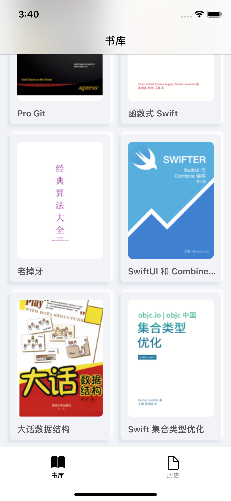

# iBook
About PDFKit learning project on iOS 11, Like iBooks.app.

## 书库
</img>

书库页面获取PDF相关数据, 可以通过KVC获取。

+ PDF书名
```swift
if let title = documentAttributes["Title"] as? String {
    cell.title = title
}
```

+ PDF作者

```swift
if let author = documentAttributes["Author"] as? String {
	 cell.author = author
}
```

+ 获取第一页作为封面，封面已经做了缓存

```swift
let thumbnailCache = NSCache<NSURL, UIImage>()
private let downloadQueue = DispatchQueue(label: "com.jovins.pdfview.thumbnail")
if let page = document.page(at: 0), let key = document.documentURL as NSURL? {     
    cell.url = key
    if let thumbnail = thumbnailCache.object(forKey: key) {
        cell.image = thumbnail
    } else {
        downloadQueue.async {
            let imgWidth: CGFloat = (UIScreen.main.bounds.width - 48)/2 - 24
            let imgHeight: CGFloat = 190
            let thumbnail = page.thumbnail(of: CGSize(width: imgWidth, height: imgHeight), for: .cropBox)
            self.thumbnailCache.setObject(thumbnail, forKey: key)
            if cell.url == key {
                DispatchQueue.main.async {
                    cell.image = thumbnail
                }
            }
        }
    }
}
```

初始化一个DocumentModel模型存储PDFDocument数据。

```swift
struct DocumentModel {
    
    var title: String = ""
    var author: String = ""
    var coverImage: UIImage?
    var url: URL?
}
```
```swift
class BookManager {
    
    static let shared = BookManager()
    
    func getDocument(_ pdfDoc: PDFDocument?) -> DocumentModel {
        
        var model = DocumentModel()
        if let document = pdfDoc, let documentAttributes = document.documentAttributes {
            if let title = documentAttributes["Title"] as? String {
                model.title = title
            } else {
                model.title = "No Title"
            }
            
            if let author = documentAttributes["Author"] as? String {
                model.author = author
            } else {
                model.author = "No Author"
            }
            
            if document.pageCount > 0, let page = document.page(at: 0) {
                let imgWidth: CGFloat = (UIScreen.main.bounds.width - 48)/2 - 24
                let imgHeight: CGFloat = 190
                let thumbnail = page.thumbnail(of: CGSize(width: imgWidth, height: imgHeight), for: .cropBox)
                model.coverImage = thumbnail
            }
            
            if let url = document.documentURL {
                model.url = url
            }
        }
        return model
    }
}
```


## PDF浏览

</img>&nbsp;</img><br>
</img>&nbsp;</img><br>

图一是PDF浏览详情页

```swift
private lazy var pdfView: PDFView = {  
    let view = PDFView()
    view.backgroundColor = Device.bgColor
    view.autoScales = true
    view.displayMode = .singlePage
    view.displayDirection = .horizontal
    view.usePageViewController(true, withViewOptions: [UIPageViewController.OptionsKey.spineLocation: 20])
    return view
}()
self.pdfView.document = self.document
```

图二是该PDF的所有页面

```swift
/// 该页面的核心代码
if let doc = self.document, let page = doc.page(at: indexPath.item) {   
    let pageNumber = indexPath.item
    cell.pageNumber = pageNumber
    let key = NSNumber(value: pageNumber)
    if let thumbnail = self.thumbnailCache.object(forKey: key) {
        cell.image = thumbnail
    } else {
        let cellSize = CGSize(width: (UIScreen.main.bounds.width - 16 * 4)/3, height: 140)
        downloadQueue.async {
            let thumbnail = page.thumbnail(of: cellSize, for: .cropBox)
            self.thumbnailCache.setObject(thumbnail, forKey: key)
            if cell.pageNumber == pageNumber {
                DispatchQueue.main.async {
                    cell.image = thumbnail
                }
            }
        }
    }
}
```

图三是该PDF的目录

```swift
/// 该页面核心代码
let outline = self.lines[indexPath.item]
cell.titleString = outline.label
cell.pageString = outline.destination?.page?.label

var indentationLevel = -1
var parent = outline.parent
while let _ = parent {
    indentationLevel += 1
    parent = parent?.parent
}
cell.indentationLevel = indentationLevel
```

图四是浏览时收藏的页面。

```swift
/// 获取收藏页
if let documentURL = self.document?.documentURL?.absoluteString, let bookmarks = UserDefaults.standard.array(forKey: documentURL) as? [Int] {
    self.bookmarks = bookmarks
    self.collection.reloadData()
}
// 显示收藏
let pageNumber = self.bookmarks[indexPath.item]
if let page = self.document?.page(at: pageNumber) {
    cell.pageNumber = pageNumber
    let key = NSNumber(value: pageNumber)
    if let thumbnail = self.thumbnailCache.object(forKey: key) {
        cell.image = thumbnail
    } else {
        let cellSize = CGSize(width: (UIScreen.main.bounds.width - 16 * 4)/3, height: 140)
        downloadQueue.async {
            let thumbnail = page.thumbnail(of: cellSize, for: .cropBox)
            self.thumbnailCache.setObject(thumbnail, forKey: key)
            if cell.pageNumber == pageNumber {
                DispatchQueue.main.async {
                    cell.image = thumbnail
                }
            }
        }
    }
}
```

打印，直接调取系统方法。

```swift
let printInteractionController = UIPrintInteractionController.shared
printInteractionController.printingItem = self.document?.dataRepresentation()
printInteractionController.present(animated: true, completionHandler: nil)
```

## 阅读历史

</img>&nbsp;</img><br>

在浏览页存储历史记录


```Swift
private func storgeHistoryList() {
    if let documentURL = self.document?.documentURL?.absoluteString {
        let cache = FileManager.default.urls(for: .cachesDirectory, in: .userDomainMask)[0].absoluteString
        let key = cache.appending("com.jovins.ibook.storgeHistory")
        if var documentURLs = UserDefaults.standard.array(forKey: key) as? [String] {
            if !documentURLs.contains(documentURL) {
                // 不存在则存储
                documentURLs.append(documentURL)
                UserDefaults.standard.set(documentURLs, forKey: key)
            }
        } else {
            // 第一次存储
            UserDefaults.standard.set([documentURL], forKey: key)
        }
    }
}
```

获取已浏览的记录

```swift
fileprivate func refreshData() {
        
    let cache = FileManager.default.urls(for: .cachesDirectory, in: .userDomainMask)[0].absoluteString
    let key = cache.appending("com.jovins.ibook.storgeHistory")
    if let documentURLs = UserDefaults.standard.array(forKey: key) as? [String] {
        var urls: [URL] = []
        for str in documentURLs {
            if let url = URL(string: str) {
                urls.append(url)
            }
        }
        self.documents = urls.compactMap { PDFDocument(url: $0) }
        self.tableView.reloadData()
    }
}
```

## 搜索

通过PDFDocument设置代理，然后调用`beginFindString`可以实现搜索功能。

```swift
func searchBar(_ searchBar: UISearchBar, textDidChange searchText: String) {
    let searchText = searchBar.text!.trimmingCharacters(in: CharacterSet.whitespaces)
    if searchText.count < 3 {
        return
    }
    self.searchResults.removeAll()
    self.tableView.reloadData()
    if let document = self.document {
        document.cancelFindString()
        document.delegate = self
        document.beginFindString(searchText, withOptions: .caseInsensitive)
    }
}
/// 代理实现的方法，可以获取到搜索结果
func didMatchString(_ instance: PDFSelection) {
    self.searchResults.append(instance)
    self.tableView.reloadData()
}
```

## 未来

该项目未来会增加`txt`、`epub`浏览功能。